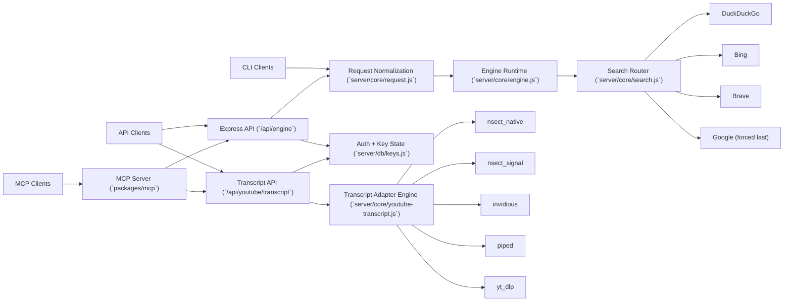

# nsect-js

```text
8888888 888b    888  .d8888b.  8888888888 .d8888b. 88888888888
  888   8888b   888 d88P  Y88b 888       d88P  Y88b    888    
  888   88888b  888 Y88b.      888       888    888    888    
  888   888Y88b 888  "Y888b.   8888888   888           888    
  888   888 Y88b888     "Y88b. 888       888           888    
  888   888  Y88888       "888 888       888    888    888    
  888   888   Y8888 Y88b  d88P 888       Y88b  d88P    888    
8888888 888    Y888  "Y8888P"  8888888888 "Y8888P"     888
```

**Programmable web retrieval infrastructure for AI products and data platforms.**

`nsect-js` is an API-first crawling and SERP extraction stack for teams that want to own web retrieval.

## What It Solves

Web retrieval fails in production for predictable reasons: brittle selectors, engine blocking, weak tenancy controls, and inconsistent contracts across tools.

Nsect ships a single runtime and request contract across:
- CLI (`nsect-engine.js`)
- HTTP API (`/api/engine`)
- Transcript API (`/api/youtube/transcript`)
- MCP server (`packages/mcp`)

It also includes a native sibling runtime in [`rust/`](./rust/README.md) for teams that want a compiled Windows `.exe` surface.
The packaged Codex skill for that runtime lives in `packages/skills/nsect-rs-runtime`.

## Product Surface (Current)

- **Unified retrieval model** — one `strategy` field with a smart `auto` default that detects JS challenges, SPAs, and infinite-scroll feeds automatically. The caller doesn't need to be a scraping expert.
- **JS challenge bypass** — detects Cloudflare, DataDome, PerimeterX, hCaptcha, reCAPTCHA, and generic interstitials; waits for auto-resolution (stealth + patience); fails honestly with `CHALLENGE_BLOCKED` instead of returning challenge pages as content.
- Browser-based extraction with rotating fingerprint profiles.
- Multi-engine search fallback with deterministic order enforcement.
- Google always forced to the final fallback attempt.
- YouTube transcript fallback adapter chain (`nsect_native -> nsect_signal -> invidious -> piped -> yt_dlp`).
- **Unified response envelope** — `output` is a string for text/html/markdown and a parsed object/array for json/links. One type contract.
- **Unified `fetch` MCP tool** — auto-routes to page/search/transcript based on input.
- Per-key authorization, rate limiting, and minimum 6s search cooldown (hosted mode only).
- Structured key lifecycle endpoints (`create`, `list`, `inspect`, `revoke`).
- MCP tool descriptors aligned to API behavior for agent workflows.
- Native Rust runtime with browser-backed engine, search fallback, transcripts, and SQLite key-state.

## Architecture



## Deployment Mode

Nsect runs in two modes. Auth, API-key state, rate limiting, and the search
cooldown are **conditional security surfaces** — they activate only in hosted
mode. In local mode (default) the engine runs keyless, freely, and without
gating middleware, so general-use local and CLI workflows need no API key.

| | Local (default) | Hosted |
|---|---|---|
| **Trigger** | unset | `NSECT_HOSTED=1` or `NODE_ENV=production` |
| Engine / transcript | no auth, no limits, async | API key + rate limit + 6s search cooldown |
| `/api/keys/*` | disabled (404) | admin auth + per-IP limiter |
| `/health` | liveness only | liveness only |
| `/health/observability` | open | admin-gated |
| `ADMIN_KEY` | ignored | **required** (fail-fast if unset) |

## Operational Controls (hosted mode)

- Search requests enforce a hard minimum `6s` cooldown per API key (`429` on violation).
- Rate limits are enforced per key over a rolling minute window.
- Admin routes are bounded by a per-IP limiter (10/min) to prevent unbounded key minting.
- API keys are stored **only** as a sha-256 hash; the plaintext secret is returned once at creation and never persisted.
- Admin authentication is header-only (`x-admin-key`) and compared with a timing-safe equality. No default secret — hosted mode requires a real `ADMIN_KEY`.
- Request validation is centralized, reducing contract drift across CLI/API/MCP.
- Error codes are explicit for upstream and browser-launch failure classes.
- API key auth is header-only (`x-api-key` or `Authorization: Bearer <key>`).

## Quick Start

```bash
bash scripts/bootstrap.sh --install-browser
bash scripts/start-api.sh
```

In local mode (the default) the engine runs **keyless** — no API key needed:

```bash
curl -sS http://localhost:3000/api/engine \
  -H "Content-Type: application/json" \
  -d '{"url":"https://example.com","format":"text"}'
```

To run in hosted mode (for multi-tenant use), set a strong `ADMIN_KEY` and
opt in with `NSECT_HOSTED=1`, then create API keys:

```bash
NSECT_HOSTED=1 ADMIN_KEY="your-strong-secret" node api.js &

bash scripts/create-api-key.sh \
  --admin-key "your-strong-secret" \
  --label local-dev \
  --rate-limit 120 \
  --search-cooldown 6
```

Run a smoke test:

```bash
bash scripts/smoke-test.sh --base-url http://localhost:3000 --api-key sk_xxx
```

## Native Runtime

Build the native sibling:

```powershell
powershell -ExecutionPolicy Bypass -File scripts/build-rust.ps1
```

Or:

```bash
bash scripts/build-rust.sh
```

Rust surface:

- `GET /health`
- key lifecycle routes
- `POST /api/engine`
- `POST /api/youtube/transcript`
- `engine` CLI subcommand with page extraction, search, screenshot, PDF, and output-file support
- `transcribe-youtube` CLI subcommand with native `--output` file support
- compiled binary output at `rust/target/release/nsect-rs.exe`

Cross-runtime operator scripts:

- `node scripts/save-transcript.mjs --runtime js|rust ...`
- `node scripts/harvest-search.mjs --runtime js|rust ...`

Rust runtime env:

- `PORT` for the HTTP listener
- `ADMIN_KEY` for admin route protection
- `NSECT_RS_DB_PATH` to override the Rust SQLite path

Packaged runtime skill:

- `packages/skills/nsect-rs-runtime`
- alias trigger skill at `packages/skills/nsect`
- bundled Windows launcher at `packages/skills/nsect-rs-runtime/scripts/run-nsect-rs.ps1`
- transcript capture helper at `packages/skills/nsect-rs-runtime/scripts/save-nsect-transcript.ps1`
- bundled release artifact at `packages/skills/nsect-rs-runtime/assets/bin/nsect-rs.exe`

## API Example

```bash
curl -sS http://localhost:3000/api/engine \
  -H "Content-Type: application/json" \
  -H "x-api-key: sk_xxx" \
  -d '{
    "query":"open source crawler frameworks",
    "googleCount":10,
    "searchEngines":["duckduckgo","bing","brave","google"],
    "format":"json"
  }'
```

YouTube transcript example:

```bash
curl -sS http://localhost:3000/api/youtube/transcript \
  -H "Content-Type: application/json" \
  -H "x-api-key: sk_xxx" \
  -d '{
    "url":"https://www.youtube.com/watch?v=dQw4w9WgXcQ",
    "language":"en",
    "format":"json",
    "methods":["nsect_native","nsect_signal","invidious","piped","yt_dlp"]
  }'
```

## MCP Integration

```bash
export NSECT_API_URL=http://localhost:3000
export NSECT_API_KEY=sk_xxx
npm run mcp
```

Optional transcript adapter tuning:

```bash
export NSECT_INVIDIOUS_INSTANCES=https://invidious.nerdvpn.de,https://yewtu.be
export NSECT_PIPED_INSTANCES=https://pipedapi.kavin.rocks,https://pipedapi.adminforge.de
export NSECT_YTDLP_COMMANDS=yt-dlp,yt-dlp.exe
```

Transcript MCP tool:

- `transcribe-youtube`

Generate an MCP config snippet:

```bash
bash scripts/render-mcp-config.sh \
  --api-url https://api.yourdomain.com \
  --api-key sk_xxx
```

## Deploy as SaaS

```bash
bash scripts/deploy-saas-host.sh \
  --repo-dir /opt/nsect \
  --admin-key "replace-with-strong-secret" \
  --port 3000 \
  --service-user "$USER"
```

## Validation

```bash
npm test
npm run test:mcp
npm run test:live
powershell -ExecutionPolicy Bypass -File scripts/test-rust.ps1
```

Cross-runtime examples:

```bash
node scripts/save-transcript.mjs --runtime js --video-id dQw4w9WgXcQ --output .docs/tmp/js-transcript.json
node scripts/save-transcript.mjs --runtime rust --video-id dQw4w9WgXcQ --output .docs/tmp/rust-transcript.json
node scripts/harvest-search.mjs --runtime rust --query "site:github.com simdjson parser SIMD" --output-dir .docs/research/harvest-rust
```

## Repository Layout

```text
.
|-- api.js
|-- nsect-engine.js
|-- server/
|   |-- core/
|   |-- routes/
|   |-- middleware/
|   `-- db/
|-- packages/
|   |-- mcp/
|   `-- skills/
|-- scripts/
|-- tests/
|-- rust/
|-- .docs/
|-- .refs/
|-- CONTRIBUTING.md
|-- ONBOARDING.md
`-- DEPLOYMENT-SAAS.md
```

## Docs

- [Onboarding](./ONBOARDING.md)
- [Contributing](./CONTRIBUTING.md)
- [Rust Runtime](./rust/README.md)
- `packages/skills/nsect-rs-runtime`
- [SaaS Deployment](./DEPLOYMENT-SAAS.md)
- [Architecture Deep Dive](./.docs/architecture.md)
- [API Reference](./.docs/api-reference.md)
- [Production Readiness](./.docs/production-readiness.md)

## License

MIT - see [LICENSE](./LICENSE).

## Engine Backlog

Future candidates (not enabled yet): `yahoo`, `yandex`, `startpage`, `ecosia`, `qwant`, `mojeek`, `kagi`.
